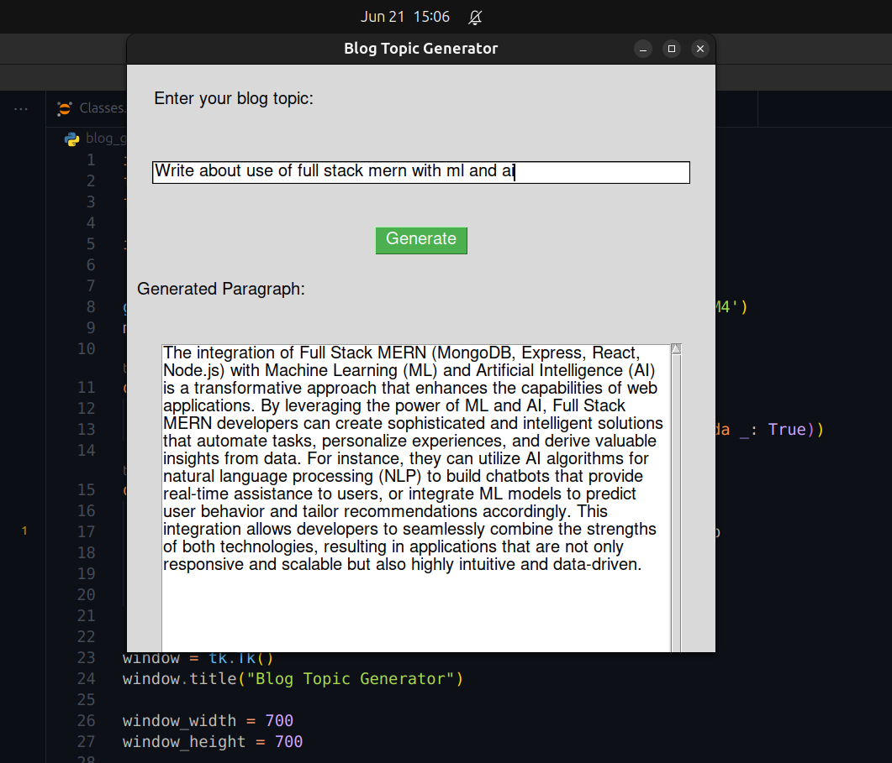
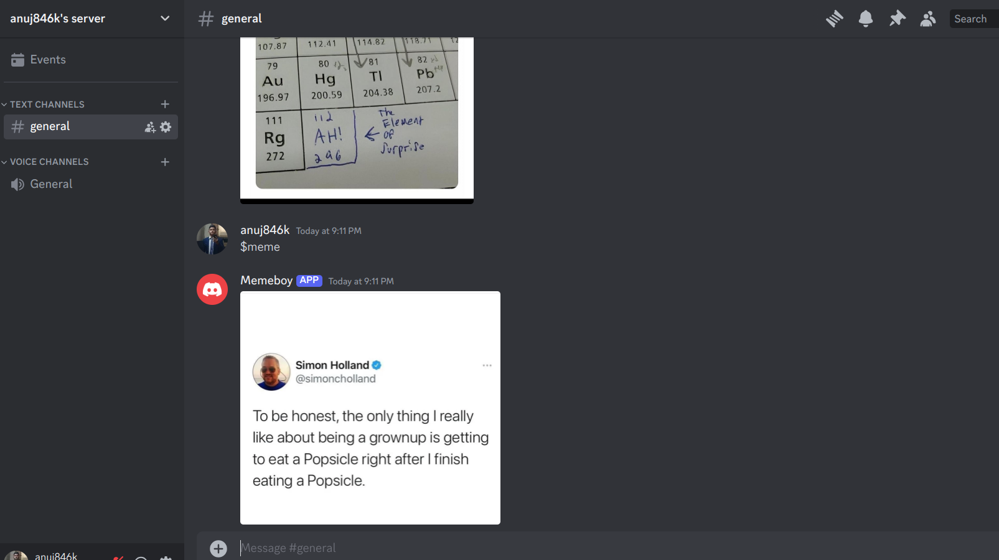

# Python Legend Final Projects

Welcome to the final projects for the "Legend of Python" course from Codedex.io. These projects are designed to showcase my skills and knowledge gained throughout the course. Below, you'll find a detailed description of each project.

## Project 1: Create a GIF with Python

### Project Description

In this project, I have created an animated GIF using Python. This involves collecting a series of images, processing them, and then combining them into a single GIF file.

### Prerequisites

- Python 3.x
- Libraries: `Pillow`, `imageio`

### Resources

- [Pillow Documentation](https://pillow.readthedocs.io/en/stable/)
- [imageio Documentation](https://imageio.readthedocs.io/en/stable/)

### Example Output

## Project 2: Generate a Blog with Gemini API

### Project Description

In this project, I have created a blog post generator using Gemini's-pro API. This involves sending prompts to the API and formatting the returned text into a blog post.

### Prerequisites

- Python 3.x
- Gemini API Key
- Libraries: `requests`

### Resources

- [Gemini API Documentation](https://aistudio.google.com/app/apikey)
- [Requests Library Documentation](https://docs.python-requests.org/en/master/)

### Example Output

## Project 3: Build a Discord Bot with Python

### Project Description

In this project, I have built a Discord bot using Python. The bot will be able to respond to user commands and interact within a Discord server.

### Prerequisites

- Python 3.x
- Libraries: `discord.py`

### Resources

- [discord.py Documentation](https://discordpy.readthedocs.io/en/stable/)
- [Discord Developer Portal](https://discord.com/developers/docs/intro)

### Example Output

---

Each project is an opportunity to apply the skills I've learned throughout the course. Have fun, experiment, and don't hesitate to explore additional features and functionalities to make your projects unique!
